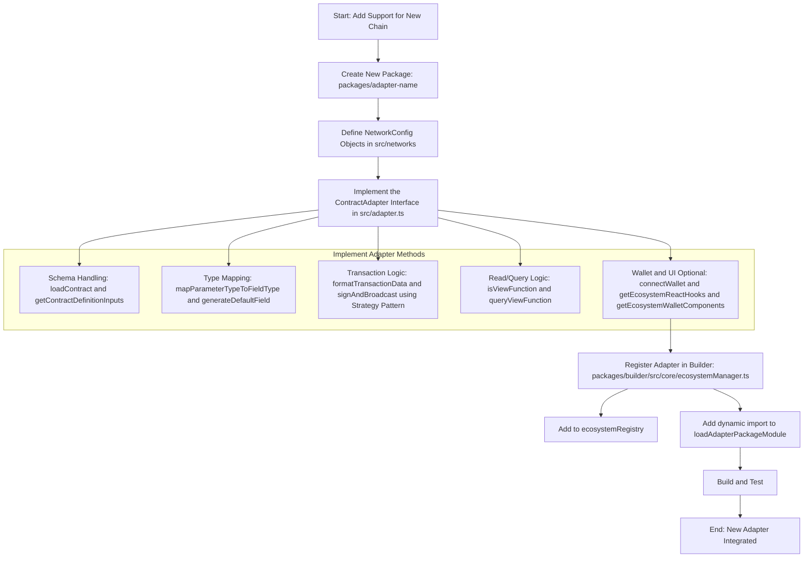

This document provides a comprehensive overview of the Contracts UI Builder’s architecture, with a focus on the patterns and requirements for creating new ecosystem adapters. It’s intended for developers tasked with extending the platform to support new blockchains.

## Core Architecture: The Adapter Pattern

The entire system is built around a **domain-driven adapter pattern**. The goal is to keep the main application (`packages/builder`) and the UI rendering library (`packages/renderer`) completely **chain-agnostic**. They have no direct knowledge of how to interact with a specific blockchain like EVM or Solana.

This decoupling is achieved through the `ContractAdapter` interface, defined in `packages/types/src/adapters/base.ts`. Each supported blockchain ecosystem must have its own package (e.g., `packages/adapter-evm`) that exports a class implementing this interface.

**Key Principles:**

* **Separation of Concerns**: Chain-specific logic is entirely encapsulated within its adapter package.
* **Shared Type System**: `packages/types` serves as the single source of truth for all shared data structures, ensuring type safety across the entire monorepo.
* **Network-Aware Adapters**: An adapter instance is not generic; it is **instantiated with a specific `NetworkConfig` object**. This makes the instance aware of its target network (e.g., Ethereum Mainnet vs. Sepolia Testnet), including its RPC endpoints, explorer URLs, and chain identifiers. The adapter stores this `networkConfig` internally and uses it for all network-dependent operations.

```mermaid
graph TB
    subgraph "Chain-Agnostic Core"
        Builder["Builder Package<br/>(Main Application)"]
        Renderer["Renderer Package<br/>(UI Rendering)"]
        Types["Types Package<br/>(Shared Type System)"]
        ReactCore["React-Core Package<br/>(Context Providers & State)"]
    end

    subgraph "UI & Design System"
        UI["UI Package<br/>(Shared React Components)"]
        Styles["Styles Package<br/>(Tailwind CSS & Theme)"]
    end

    subgraph "Utilities & Storage"
        Utils["Utils Package<br/>(Config, Logging, Helpers)"]
        Storage["Storage Package<br/>(IndexedDB/Dexie Services)"]
    end

    subgraph "Adapter Layer"
        CA["ContractAdapter<br/>Interface"]
        EVM["EVM Adapter<br/>(Ethereum, Polygon, etc.)"]
        Solana["Solana Adapter"]
        Midnight["Midnight Adapter"]
        Stellar["Stellar Adapter"]
        NewChain["Your New Chain<br/>Adapter"]
    end

    subgraph "Configuration & Services"
        AppConfig["App Config<br/>Service"]
        UserConfig["User Config<br/>Services"]
        NetworkConfigs["Network<br/>Configurations"]
    end

    subgraph "Execution Layer"
        EOA["EOA Strategy"]
        Relayer["Relayer Strategy"]
        Multisig["Multisig Strategy"]
        Wallet["Wallet<br/>Integration"]
    end

    %% Core relationships
    Builder --> CA
    Builder --> ReactCore
    Builder --> Storage
    Renderer --> CA
    Renderer --> UI
    ReactCore --> Types
    CA --> Types

    %% UI dependencies
    UI --> Utils
    UI --> Styles
    Builder --> UI
    Builder --> Styles
    Renderer --> Styles

    %% Storage and utils dependencies
    Storage --> Utils
    Storage --> Types
    ReactCore --> Utils

    %% Adapter implementations
    CA -.-> EVM
    CA -.-> Solana
    CA -.-> Midnight
    CA -.-> Stellar
    CA -.-> NewChain

    %% Configuration flow
    EVM --> NetworkConfigs
    EVM --> AppConfig
    EVM --> UserConfig
    Utils --> AppConfig

    %% Execution strategies
    EVM --> EOA
    EVM --> Relayer
    EVM --> Multisig
    EVM --> Wallet

    %% Styling
    classDef corePackage fill:#ffffff,stroke:#1976d2,stroke-width:3px,color:#000000
    classDef uiPackage fill:#f5f5f5,stroke:#9c27b0,stroke-width:2px,color:#000000
    classDef utilityPackage fill:#ffffff,stroke:#4caf50,stroke-width:2px,color:#000000
    classDef adapterPackage fill:#f5f5f5,stroke:#7b1fa2,stroke-width:2px,color:#000000
    classDef configPackage fill:#ffffff,stroke:#388e3c,stroke-width:2px,color:#000000
    classDef executionPackage fill:#f5f5f5,stroke:#f57c00,stroke-width:2px,color:#000000
    classDef interfacePackage fill:#ffffff,stroke:#d32f2f,stroke-width:4px,color:#000000

    class Builder,Renderer,Types,ReactCore corePackage
    class UI,Styles uiPackage
    class Utils,Storage utilityPackage
    class EVM,Solana,Midnight,Stellar,NewChain adapterPackage
    class AppConfig,UserConfig,NetworkConfigs configPackage
    class EOA,Relayer,Multisig,Wallet executionPackage
    class CA interfacePackage
```



## The `ContractAdapter` Interface: Your Implementation Contract

The `ContractAdapter` interface is the most critical file for an adapter developer. Your new adapter class **must** implement every method defined here. The methods can be grouped by functionality:

### Contract Definition & Schema Handling

These methods handle loading and interpreting a contract’s interface (like an ABI or IDL).

* `getContractDefinitionInputs()`: Must return a `FormFieldType[]` array that defines the inputs your adapter needs to locate a contract (e.g., an address field, an optional ABI/IDL textarea).
* `loadContract(artifacts)`: Takes the form values from `getContractDefinitionInputs` and returns a `ContractSchema`. This is your main entry point for fetching and parsing the contract’s interface. You’ll handle logic here like: "If a manual ABI is provided, parse it. If not, use the address to fetch it from a block explorer."
* `loadContractWithMetadata(artifacts)`: An enhanced version of `loadContract` that also returns metadata about the source (`fetched` or `manual`), proxy information (`ProxyInfo`), and definition details (`ContractDefinitionMetadata`). This is used for advanced features like ABI comparison and proxy detection.
* `validateContractDefinition(definition)` & `hashContractDefinition(definition)`: (Optional) Implement these to support ABI/IDL validation and version comparison features. The EVM adapter provides a reference implementation in `abi/comparison.ts`.

### Form Generation & Type Mapping

These methods bridge the gap between blockchain-specific types and the generic form fields used by the UI.

* `mapParameterTypeToFieldType(parameterType)`: A simple mapping from a blockchain type string (e.g., ’uint256'`) to a default `FieldType` (e.g., ’number'`).
* `getCompatibleFieldTypes(parameterType)`: Returns an array of all `FieldType`s that could be used for a given blockchain type. For example, a ’bool'` might be compatible with ’checkbox'`, ’select'`, and ’radio'`.
* `generateDefaultField(parameter)`: Creates a complete `FormFieldType` object for a given `FunctionParameter`, including a default label, placeholder, and validation rules.

### Transaction Execution

This is the core of state-changing interactions. The system uses an **Execution Strategy Pattern** to support multiple ways of sending a transaction (e.g., EOA, Relayer).

* `getSupportedExecutionMethods()`: Returns a list of supported methods (`ExecutionMethodDetail`) for your ecosystem (e.g., EOA, Multisig).
* `validateExecutionConfig(config)`: Validates a user’s `ExecutionConfig` for a specific method. For example, for an EOA with a specific address, it checks that the connected wallet matches.
* `formatTransactionData(...)`: This crucial method takes the raw `submittedInputs` from the UI form and transforms them into the data payload your blockchain’s client library expects. The EVM adapter’s implementation in `transaction/formatter.ts` shows how to parse strings into `BigInt`, checksum addresses, and structure complex tuples.
* `signAndBroadcast(...)`: The main function to execute a transaction. It receives the data from `formatTransactionData` and an `ExecutionConfig`. Your implementation should use a factory pattern to select the correct **Execution Strategy** (e.g., `EoaExecutionStrategy`, `RelayerExecutionStrategy`) based on `executionConfig.method`.
* `waitForTransactionConfirmation?(txHash)`: (Optional) Implement this to allow the UI to wait for a transaction to be finalized.

### Read-Only Queries

These methods handle fetching data from the blockchain without creating a transaction.

* `isViewFunction(functionDetails)`: A simple utility to check if a function is read-only.
* `queryViewFunction(...)`: Fetches data from a read-only function. It should use the `networkConfig` to connect to the correct RPC endpoint. The EVM adapter implementation in `query/handler.ts` provides a robust example of creating a public client and handling various scenarios (e.g., using the wallet’s provider vs. a fallback provider).
* `formatFunctionResult(...)`: Formats the raw data returned from `queryViewFunction` into a human-readable string for display in the UI. This should handle `BigInt`, arrays, and complex objects.

### Wallet Interaction & UI Facilitation

These methods allow the adapter to provide a rich, ecosystem-specific wallet experience. The EVM adapter has a very sophisticated implementation for this, designed to be extensible with UI kits like RainbowKit. **For simpler ecosystems, your implementation can be much more direct.**

* `supportsWalletConnection()`: Return `true` if your ecosystem has wallets.
* `getAvailableConnectors()`: Return a list of wallet connectors the user can choose from.
* `connectWallet(connectorId)`: Logic to initiate a connection with the chosen wallet.
* `disconnectWallet()`: Logic to disconnect.
* `getWalletConnectionStatus()`: Return the current status (`isConnected`, `address`, `chainId`).
* `onWalletConnectionChange?(callback)`: (Optional) An event listener for status changes.

**Advanced UI Facilitation (The "UI Kit" Pattern):**

This optional but powerful pattern allows an adapter to provide React components and hooks that integrate with its ecosystem’s native wallet libraries (e.g., `wagmi` for EVM).

* `configureUiKit(config, options)`: The entry point for the application to tell the adapter which UI kit to use (e.g., ’rainbowkit'`, ’custom'`) and provide configuration.
* `getEcosystemReactUiContextProvider()`: Must return a stable React Component that provides the necessary context for your wallet library (e.g., for EVM, this is `<WagmiProvider>` and `<QueryClientProvider>`). See `EvmWalletUiRoot.tsx` for a reference implementation that avoids UI flicker.
* `getEcosystemReactHooks()`: Must return an object of facade hooks (e.g., `useAccount`, `useSwitchChain`). These hooks should wrap the native library’s hooks. **Crucially, your implementation must map the return values to a conventional format** to ensure UI components remain chain-agnostic (e.g., map the underlying library’s `isLoading` property to `isPending`).
* `getEcosystemWalletComponents()`: Must return an object of standardized UI components (`ConnectButton`, `AccountDisplay`, etc.) for the configured UI kit.

For a deep dive into this advanced pattern, study the EVM adapter’s wallet module (`packages/adapter-evm/src/wallet/`) and the `ADDING_NEW_UI_KITS.md` guide.

## Standardized Adapter Package Structure

To ensure consistency, new adapter packages (`packages/adapter-<your-chain>`) should follow this directory structure:

```
adapter-<your-chain>/
└── src/
    ├── adapter.ts             // Main Adapter class implementing ContractAdapter
    ├── networks/              // Network configurations for your chain
    │   ├── mainnet.ts
    │   ├── testnet.ts
    │   └── index.ts
    ├── [chain-def]/           // e.g., idl/ (Solana), abi/ (EVM) - For loading contracts
    │   ├── loader.ts
    │   └── transformer.ts
    ├── mapping/               // Type mapping and default field generation
    │   ├── type-mapper.ts
    │   └── field-generator.ts
    ├── transform/             // Data serialization/deserialization
    │   ├── input-parser.ts
    │   └── output-formatter.ts
    ├── transaction/           // Transaction execution (with strategy pattern)
    │   ├── execution-strategy.ts
    │   ├── eoa.ts             // Example strategy
    │   └── ...
    ├── query/                 // View function querying
    │   ├── handler.ts
    │   └── view-checker.ts
    ├── wallet/                // Wallet connection & UI facilitation logic
    ├── configuration/         // Explorer URLs, execution method validation
    ├── types.ts               // Internal types specific to this adapter
    ├── utils/                 // Adapter-specific utilities
    └── index.ts               // Main package export
```

## Configuration Management

A robust adapter must handle runtime configuration overrides. The project provides utility services for this: `appConfigService`, `userRpcConfigService`, and `userExplorerConfigService`.

Your adapter logic should follow a clear priority order when resolving settings like RPC URLs or explorer API keys:

1. **User-Provided Config**: Check the `user...ConfigService` first. This is for settings configured by the end-user in the UI and stored in `localStorage`.
2. **Application Config**: If no user config is found, check `appConfigService`. This is for settings provided by the application deployer in `app.config.json` or environment variables.
3. **Default Config**: If neither of the above is present, fall back to the default value in the `NetworkConfig` object your adapter was instantiated with.

The functions `resolveRpcUrl` and `resolveExplorerConfig` in the EVM adapter provide excellent reference implementations of this layered pattern.

## Step-by-Step Guide to Creating a New Adapter

1. **Create Package**: In the `packages/` directory, create `adapter-<chain-name>`.
2. **Define `package.json`**: Add dependencies on `@openzeppelin/contracts-ui-builder-types` and any chain-specific SDKs. Set up standard build scripts (copy from an existing adapter).
3. **Implement `NetworkConfig`**: In `src/networks/`, define your chain’s specific `...NetworkConfig` interface (extending `BaseNetworkConfig`) and create configuration objects for its mainnets and testnets. Export them and a combined list (e.g., `export const myChainNetworks = [...]`).
4. **Implement `ContractAdapter`**: Create `src/adapter.ts` and begin implementing the `ContractAdapter` interface, delegating logic to the modular subdirectories as described above. Start with the core methods and tackle the optional UI/wallet methods last.
5. **Register in Builder**: Open `packages/builder/src/core/ecosystemManager.ts` and:
   * Add your ecosystem to the `Ecosystem` type.
   * Add an entry to the `ecosystemRegistry`, providing the `networksExportName` (e.g., ’myChainNetworks'`) and the `AdapterClass`.
   * Add a case to `loadAdapterPackageModule` to enable dynamic importing of your new package.
6. **Build and Test**: Build your new package and the main builder app. Add unit and integration tests to ensure your adapter functions correctly within the larger system.


