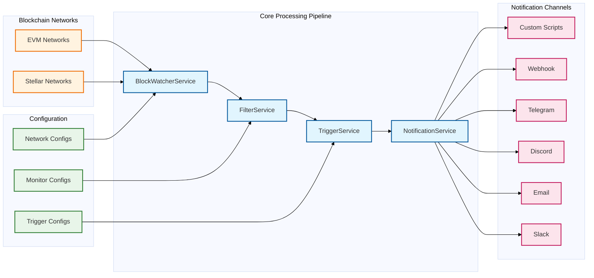
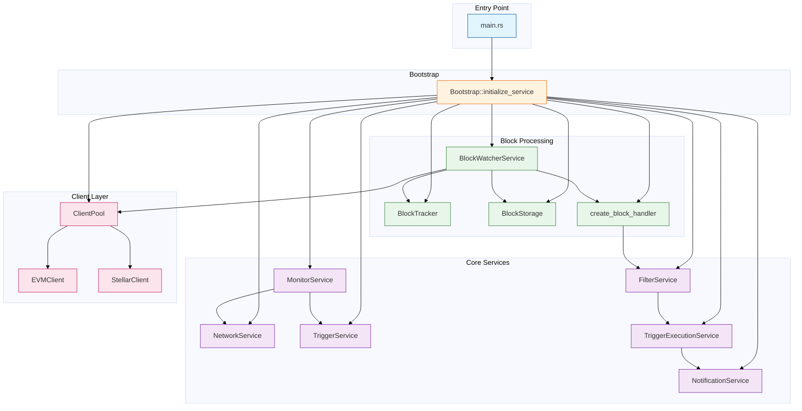
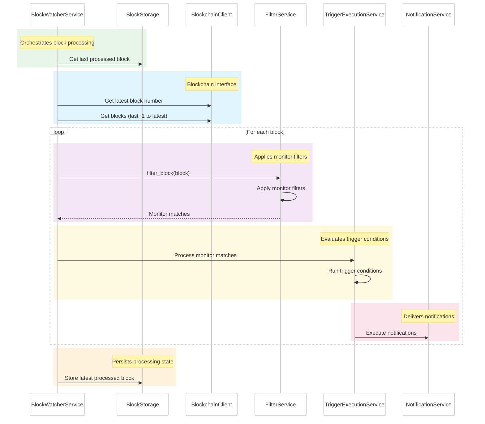

This document describes the high-level architecture of OpenZeppelin Monitor, including the core components, their interactions, and the overall system design. It provides a technical overview of how the service processes blockchain data and triggers notifications based on configurable conditions.

## System Overview

OpenZeppelin Monitor is organized as a data processing pipeline that spans from blockchain data collection to notification delivery. The system follows a modular architecture with distinct components for each step in the monitoring process, designed for scalability and extensibility.

### High-Level Architecture

The diagram below shows the core processing pipeline of OpenZeppelin Monitor, from blockchain networks and configuration through to notification channels:

## Component Architecture

The system consists of several core services that are initialized at startup and work together to process blockchain data and trigger notifications. The service initialization and dependencies are managed through the bootstrap module.

### Service Initialization Flow

### Core Components

#### Block Processing Components

* ***BlockWatcherService***: Orchestrates the block monitoring process by polling blockchain networks for new blocks and coordinating the processing pipeline.
* ***BlockTracker***: Tracks processed block numbers to prevent duplicate processing and ensure data consistency across service restarts.
* ***BlockStorage***: Persists block processing state for recovery and maintains the last processed block number for each network.

#### Client Layer Components

* ***ClientPool***: Manages blockchain client instances and provides network connectivity with connection pooling and failover capabilities.
* ***EVMClient***: Handles communication with Ethereum Virtual Machine compatible networks (Ethereum, Polygon, BSC, etc.).
* ***StellarClient***: Manages connections to Stellar blockchain networks with protocol-specific optimizations.

#### Processing Pipeline Components

* ***FilterService***: Applies monitor filters to blockchain data, evaluating conditions and match expressions to identify relevant transactions and events.
* ***TriggerExecutionService***: Executes triggers based on matched monitor conditions, evaluating trigger logic and preparing notification payloads.
* ***NotificationService***: Delivers notifications through configured channels (Slack, Email, Discord, Telegram, Webhooks, Scripts).

#### Configuration Management Components

* ***MonitorService***: Manages monitor configurations and provides access to active monitors with validation and lifecycle management.
* ***NetworkService***: Manages network configurations and provides network details for client connections and monitoring operations.
* ***TriggerService***: Manages trigger configurations and provides trigger details for notification execution.

### Service Responsibilities

The following table describes the key responsibilities of each service in the OpenZeppelin Monitor architecture:

| Service | Responsibility |
| --- | --- |
| **MonitorService** | Manages monitor configurations and provides access to active monitors |
| **NetworkService** | Manages network configurations and provides network details |
| **TriggerService** | Manages trigger configurations and provides trigger details |
| **FilterService** | Filters blockchain data based on monitor conditions and match expressions |
| **TriggerExecutionService** | Executes triggers based on matched monitor conditions |
| **NotificationService** | Delivers notifications through configured channels |
| **BlockWatcherService** | Polls blockchain networks for new blocks and coordinates processing |
| **BlockTracker** | Tracks processed block numbers to prevent duplicate processing |
| **BlockStorage** | Persists block processing state for recovery |
| **ClientPool** | Manages blockchain client instances and provides network connectivity |

### Block Processing Workflow

The following _runtime flow_ illustrates how data moves through the system, from blockchain networks to notification channels. This sequence represents the core monitoring loop that executes for each configured network.

### Data Flow Architecture

#### 1. Block Discovery Phase
The `BlockWatcherService` initiates the monitoring cycle by:

* Retrieving the last processed block number from `BlockStorage`
* Querying the blockchain for the latest block number
* Calculating the range of new blocks to process

#### 2. Data Retrieval Phase
The `BlockchainClient` fetches block data:

* Connects to the appropriate blockchain network via RPC
* Retrieves full block data including transactions and events
* Handles network-specific data formats and protocols

#### 3. Filtering Phase
The `FilterService` processes each block:

* Applies monitor-specific filters to transactions and events
* Evaluates match expressions and conditions
* Identifies relevant data that matches monitoring criteria

#### 4. Trigger Evaluation Phase
The `TriggerExecutionService` processes matches:

* Evaluates trigger conditions for matched data
* Prepares notification payloads with relevant context
* Determines which notification channels to activate

#### 5. Notification Delivery Phase
The `NotificationService` delivers alerts:

* Formats messages for each notification channel
* Handles channel-specific delivery protocols
* Manages delivery retries and error handling

#### 6. State Persistence Phase
The `BlockStorage` updates processing state:

* Records the latest processed block number
* Ensures data consistency for recovery scenarios
* Maintains processing history for debugging

### Error Handling and Resilience

The architecture includes several resilience mechanisms:

* ***Connection Pooling***: The `ClientPool` manages multiple connections to prevent single points of failure
* ***State Recovery***: `BlockStorage` enables the service to resume from the last known good state after restarts
* ***Retry Logic***: Notification delivery includes configurable retry mechanisms for transient failures
* ***Graceful Degradation***: Individual component failures don’t cascade to the entire system

For detailed information about RPC logic and network communication, see the [RPC section](/monitor/1.1.x/rpc).

## Configuration Architecture

The system uses a JSON-based configuration system organized into distinct categories:

### Configuration Categories

* ***Network Configurations***: Define blockchain network connections, RPC endpoints, and network parameters
* ***Monitor Configurations***: Specify monitoring rules, conditions, and network/trigger references
* ***Trigger Configurations***: Define notification settings and script definitions
* ***Filter Configurations***: Contain match filter scripts for data filtering

### Configuration Validation

The system implements comprehensive validation:

* Cross-reference validation between monitors, networks, and triggers
* Schema validation for all configuration files
* Runtime validation of configuration references during service startup

For configuration examples and best practices, see the [Configuration Guidelines](/monitor/1.1.x#configuration_guidelines) section in the user documentation.

## Extensibility Points

The architecture is designed for extensibility in several key areas:

### Blockchain Support
* ***Client Layer***: New blockchain protocols can be added by implementing the `BlockchainClient` trait
* ***Transport Layer***: Protocol-specific transport clients handle network communication details
* ***Filter Layer***: Chain-specific filters process protocol-dependent data formats

### Notification Channels
* ***Channel Plugins***: New notification channels can be added by implementing the notification interface
* ***Script Support***: Custom notification logic can be implemented using Python, JavaScript, or Bash scripts

### Monitoring Logic
* ***Expression Engine***: Flexible expression evaluation for complex monitoring conditions
* ***Script Triggers***: Custom trigger logic can be implemented using supported scripting languages

## Performance Considerations

The architecture is optimized for:

* ***Concurrent Processing***: Multiple networks can be monitored simultaneously
* ***Efficient Block Processing***: Batch processing of blocks to minimize RPC calls
* ***Memory Management***: Streaming processing of large blocks to prevent memory issues
* ***Connection Reuse***: Client pooling reduces connection overhead

## Security Architecture

The system implements several security measures:

* ***Secure Protocols***: Support for HTTPS/WSS
* ***Secret Management***: Secure handling of API keys and sensitive configuration data
* ***Input Validation***: Comprehensive validation of all external inputs and configurations

## Related Documentation

For detailed information about the project structure, source code organization, and development resources, see the [Project Structure](/monitor/1.1.x/project-structure) guide.

For information about RPC logic and network communication, see the [RPC section](/monitor/1.1.x/rpc).

For configuration examples and best practices, see the [Configuration Guidelines](/monitor/1.1.x#configuration_guidelines) section in the user documentation.
