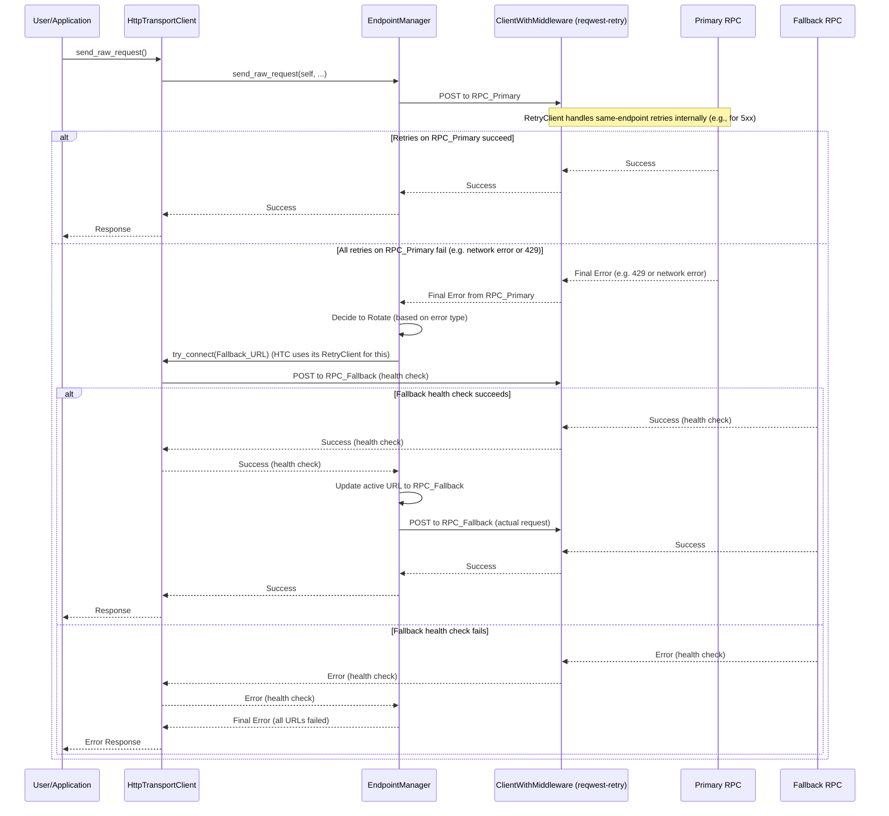
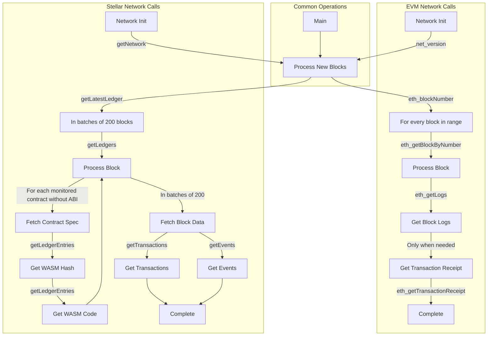

## Overview

The OpenZeppelin Monitor includes a robust RPC client implementation with automatic endpoint rotation and fallback capabilities. This ensures reliable blockchain monitoring even when individual RPC endpoints experience issues.

* Multiple RPC endpoint support with weighted load balancing
* Automatic fallback on endpoint failures
* Rate limit handling (429 responses)
* Connection health checks
* Thread-safe endpoint rotation

## Configuration

### RPC URLs

RPC endpoints are configured in the network configuration files with weights for load balancing:

```json
{
  "rpc_urls": [
    {
      "type_": "rpc",
      "url": {"type": "plain", "value": "https://primary-endpoint.example.com"},
      "weight": 100
    },
    {
      "type_": "rpc",
      "url": {"type": "plain", "value": "https://backup-endpoint.example.com"},
      "weight": 50
    }
  ]
}
```


For high-availability setups, configure at least 3 (private) RPC endpoints with appropriate weights to ensure continuous operation even if multiple endpoints fail.


### Configuration Fields

| Field | Type | Description |
| --- | --- | --- |
| `**type_**` | `String` | Type of endpoint (currently only "rpc" is supported) |
| `**url.type**` | `String` | Secret type ("Plain", "Environment", or "HashicorpCloudVault") |
| `**url.value**` | `String` | The RPC endpoint URL |
| `**weight**` | `Number` | Load balancing weight (0-100) |

## Endpoint Management

The endpoint manager handles

* Initial endpoint selection based on weights
* Automatic rotation on failures
* Connection health checks
* Thread-safe endpoint updates

Each blockchain network type has its own specialized transport client that wraps the base `HttpTransportClient`.
The transport clients are implemented as:

1. **Core HTTP Transport**: `HttpTransportClient` provides core HTTP functionality, including the integrated retryable client.
2. **Network-Specific Transports**:
   * `EVMTransportClient` for EVM networks
   * `StellarTransportClient` for Stellar networks

### Rotation Strategy

The RPC client includes an automatic rotation strategy for handling specific types of failures:

* For 429 (Too Many Requests) responses:
  * Immediately rotates to a fallback URL
  * Retries the request with the new endpoint
  * Continues this process until successful or all endpoints are exhausted

#### Configuration Options

The error codes that trigger RPC endpoint rotation can be customized in the `src/services/blockchain/transports/mod.rs` file.

```rust
pub const ROTATE_ON_ERROR_CODES: [u16; 1] = [429];
```

### Retry Strategy

The transport layer uses a combination of same-endpoint retries and endpoint rotation to handle transient failures and maintain service availability.

#### Same-Endpoint Retry (via `reqwest-retry`)

The `HttpTransportClient` (and by extension, EVM and Stellar clients) utilizes a `reqwest_middleware::ClientWithMiddleware`. This client is configured during initialization using the `utils::http::create_retryable_http_client` utility. This utility layers `reqwest_retry::RetryTransientMiddleware` on top of a shared base `reqwest::Client`.

This middleware handles:

* Automatic retries for transient HTTP errors (e.g., 5xx server errors, network timeouts) for requests made to the **currently active RPC URL**.
* An exponential backoff policy between these retry attempts.
* Parameters like the number of retries, backoff durations, and jitter are defined in an `RetryConfig` struct (see [Configuration Options](#configuration-options)).
* This same-endpoint retry mechanism is independent of, and operates before, the endpoint rotation logic. If all same-endpoint retries fail for the current URL, the error is then processed by the `EndpointManager`.

#### Endpoint Rotation (via `EndpointManager`)

If all same-endpoint retries fail for the currently active RPC URL, or if certain HTTP status codes (e.g., 429 Too Many Requests, as defined in `ROTATE_ON_ERROR_CODES`) are received, the `EndpointManager` (used by `HttpTransportClient`) will attempt to rotate to a healthy fallback URL. This ensures that if one endpoint becomes persistently unavailable, the system can switch to an alternative. The health check for a fallback URL also benefits from the same-endpoint retry mechanism.

#### Configuration Options

The same-endpoint retry behavior is configured via the `RetryConfig` struct, which is used by `create_retryable_http_client` to set up the `ExponentialBackoff` policy for `reqwest-retry`.

The default settings for `RetryConfig` result in an `ExponentialBackoff` policy approximately equivalent to:
```rust
// This illustrates the default policy created by RetryConfig::default()
// and create_retryable_http_client.
let http_retry_config = RetryConfig::default();
let retry_policy = ExponentialBackoff::builder()
  .base(http_retry_config.base_for_backoff)
  .retry_bounds(http_retry_config.initial_backoff, http_retry_config.max_backoff)
  .jitter(http_retry_config.jitter)
  .build_with_max_retries(http_retry_config.max_retries);
```

The configurable options are defined in the `RetryConfig` struct:
```rust
// In utils::http
pub struct RetryConfig {
    /// Maximum number of retries for transient errors (after the initial attempt).
    pub max_retries: u32,
    /// Initial backoff duration before the first retry.
    pub initial_backoff: Duration,
    /// Maximum backoff duration for retries.
    pub max_backoff: Duration,
    /// Base for the exponential backoff calculation (e.g., 2).
    pub base_for_backoff: u64,
    /// Jitter to apply to the backoff duration.
    pub jitter: Jitter,
}
```

The client architecture ensures efficient resource use and consistent retry behavior:

1. A single base `reqwest::Client` is created by `HttpTransportClient` with optimized connection pool settings. This base client is shared.
2. The `create_retryable_http_client` utility takes this base client and an `RetryConfig` to produce a `ClientWithMiddleware`.
3. This `ClientWithMiddleware` (the "retryable client") is then used for all HTTP operations within `HttpTransportClient`, including initial health checks, requests sent via `EndpointManager`, and `try_connect` calls during rotation. This ensures all operations benefit from the configured retry policy and the shared connection pool.

Each transport client may define its own retry policy:

```rust
// src/services/transports/http.rs
pub struct HttpTransportClient {
  pub client: ClientWithMiddleware,
  endpoint_manager: EndpointManager,
  test_connection_payload: Option<String>,
}

// Example of client creation with retry mechanism
// Use default retry policy
let http_retry_config = RetryConfig::default();

// Create the base HTTP client
let base_http_client = reqwest::ClientBuilder::new()
  .pool_idle_timeout(Duration::from_secs(90))
  .pool_max_idle_per_host(32)
  .timeout(Duration::from_secs(30))
  .connect_timeout(Duration::from_secs(20))
  .build()
  .context("Failed to create base HTTP client")?;

// Create a retryable HTTP client with the base client and retry policy
let retryable_client = create_retryable_http_client(
  &http_retry_config,
  base_http_client,
  Some(TransientErrorRetryStrategy), // Use custom or default retry strategy
);

```

### Implementation Details
The `EndpointManager` uses the retry-enabled `ClientWithMiddleware` provided by `HttpTransportClient` for its attempts on the primary URL. If these attempts (including internal `reqwest-retry` retries) ultimately fail with an error that warrants rotation (e.g., a 429 status code, or persistent network errors), then `EndpointManager` initiates the URL rotation sequence.



## List of RPC Calls

Below is a list of RPC calls made by the monitor for each network type for each iteration of the cron schedule.
As the number of blocks being processed increases, the number of RPC calls grows, potentially leading to rate limiting issues or increased costs if not properly managed.



**EVM**

* RPC Client initialization (per active network): `net_version`
* Fetching the latest block number (per cron iteration): `eth_blockNumber`
* Fetching block data (per block): `eth_getBlockByNumber`
* Fetching block logs (per block): `eth_getLogs`
* Fetching transaction receipt (only when needed):
  * When monitor condition requires receipt-specific fields (e.g., `gas_used`)
  * When monitoring transaction status and no logs are present to validate status

**Stellar**

* RPC Client initialization (per active network): `getNetwork`
* Fetching the latest ledger (per cron iteration): `getLatestLedger`
* Fetching ledger data (batched up to 200 in a single request): `getLedgers`
* During block filtering, for each monitored contract without an ABI in config:
  * Fetching contract instance data: `getLedgerEntries`
  * Fetching contract WASM code: `getLedgerEntries`
* Fetching transactions (batched up to 200 in a single request): `getTransactions`
* Fetching events (batched up to 200 in a single request): `getEvents`

## Best Practices

* Configure multiple private endpoints with appropriate weights
* Use geographically distributed endpoints when possible
* Monitor endpoint health and adjust weights as needed
* Set appropriate retry policies based on network characteristics

## Troubleshooting

### Common Issues

* **429 Too Many Requests**: Increase the number of fallback URLs, adjust weights or reduce monitoring frequency
* **Connection Timeouts**: Check endpoint health and network connectivity
* **Invalid Responses**: Verify endpoint compatibility with your network type

### Logging

Enable debug logging for detailed transport information:

```bash
RUST_LOG=debug
```

This will show:

* Endpoint rotations
* Connection attempts
* Request/response details
